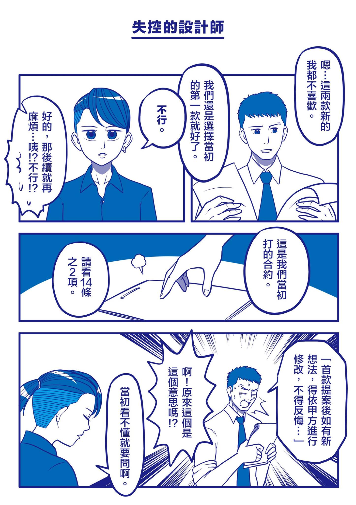
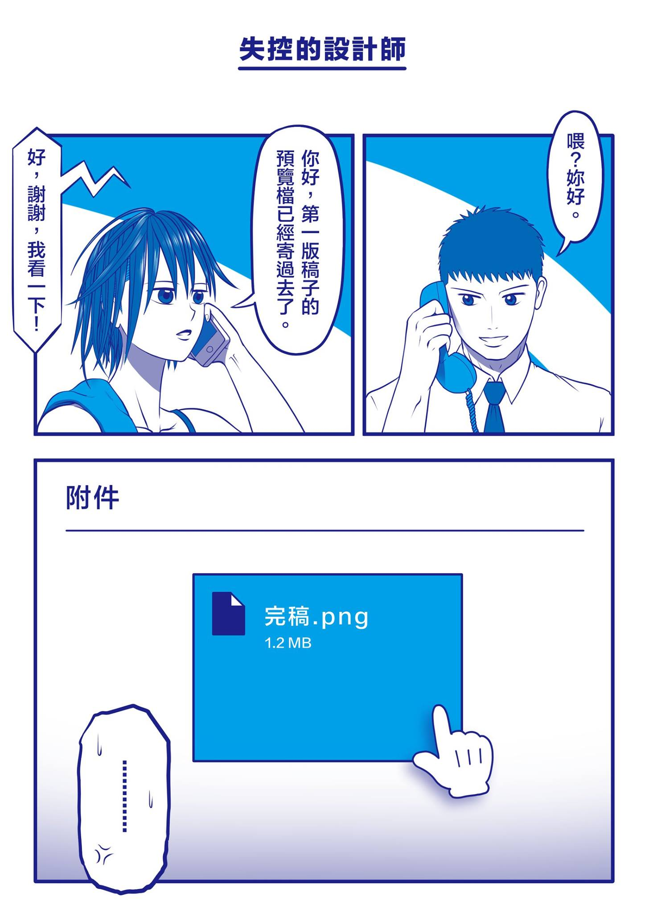
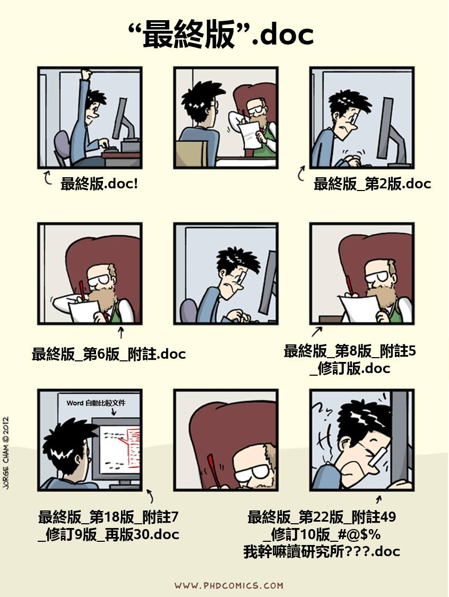

title: Git
output: index.html

--

<h1 style="font-size: 72px">
	Git
</h1>
 

## Denny Huang

--

### Who am I ?

 
<h2 style="font-size: 60px">
  <b>Denny Huang</b>
</h2>

* 雷亞遊戲 Rayark Inc.

* SITCON 2013, 2014 總召

* <a href="http://about.me/denny0223" target="_blank">About me</a>

--

# Survey

--

# Git / GitHub
## It&apos;s different

--

<iframe width="800" height="600" src="https://www.youtube.com/embed/pPYgTFt7zLg?start=93" frameborder="0" gesture="media" allow="encrypted-media" allowfullscreen></iframe>

--

  

  
    ref:&nbsp;
	<a href="https://www.facebook.com/HsiehTungLin/photos/a.1477634572350750.1073741878.484406378340246/1476593382454869/" target="_blank">失控的設計師</a>&nbsp;
  

--

  

  
    ref:&nbsp;
	<a href="https://www.facebook.com/HsiehTungLin/photos/a.1477634572350750.1073741878.484406378340246/1514180378696169/" target="_blank">失控的設計師</a>&nbsp;
  

--

  

  
    ref:&nbsp;
	<a href="https://www.facebook.com/photo.php?fbid=1592343944115344" target="_blank">https://www.facebook.com/photo.php?fbid=1592343944115344</a>&nbsp;
  

--

  

  
    Source:&nbsp;
	<a href="https://speakerdeck.com/crboy/code-smart-dont-code-hard" target="_blank">Code Smart, Don&apos;t Code hard</a>&nbsp;
	by 畢玉泉(CrBoy)&lt;crboy@crboy.net&gt;
  

--

  

  
    Source:&nbsp;
	<a href="https://speakerdeck.com/crboy/code-smart-dont-code-hard" target="_blank">Code Smart, Don&apos;t Code hard</a>&nbsp;
	by 畢玉泉(CrBoy)&lt;crboy@crboy.net&gt;
  

--

  

  
    Source:&nbsp;
	<a href="https://speakerdeck.com/crboy/code-smart-dont-code-hard" target="_blank">Code Smart, Don&apos;t Code hard</a>&nbsp;
	by 畢玉泉(CrBoy)&lt;crboy@crboy.net&gt;
  

--

  

  
    Source:&nbsp;
	<a href="https://speakerdeck.com/crboy/code-smart-dont-code-hard" target="_blank">Code Smart, Don&apos;t Code hard</a>&nbsp;
	by 畢玉泉(CrBoy)&lt;crboy@crboy.net&gt;
  

--

  

  
    Source:&nbsp;
	<a href="https://speakerdeck.com/crboy/code-smart-dont-code-hard" target="_blank">Code Smart, Don&apos;t Code hard</a>&nbsp;
	by 畢玉泉(CrBoy)&lt;crboy@crboy.net&gt;
  

--

  

  
    Source:&nbsp;
	<a href="https://speakerdeck.com/crboy/code-smart-dont-code-hard" target="_blank">Code Smart, Don&apos;t Code hard</a>&nbsp;
	by 畢玉泉(CrBoy)&lt;crboy@crboy.net&gt;
  

--

  

  
    Source:&nbsp;
	<a href="https://speakerdeck.com/crboy/code-smart-dont-code-hard" target="_blank">Code Smart, Don&apos;t Code hard</a>&nbsp;
	by 畢玉泉(CrBoy)&lt;crboy@crboy.net&gt;
  

--

  

  
    Source:&nbsp;
	<a href="https://speakerdeck.com/crboy/code-smart-dont-code-hard" target="_blank">Code Smart, Don&apos;t Code hard</a>&nbsp;
	by 畢玉泉(CrBoy)&lt;crboy@crboy.net&gt;
  

--

  

  
    Source:&nbsp;
	<a href="https://speakerdeck.com/crboy/code-smart-dont-code-hard" target="_blank">Code Smart, Don&apos;t Code hard</a>&nbsp;
	by 畢玉泉(CrBoy)&lt;crboy@crboy.net&gt;
  

--

  

  
    Source:&nbsp;
	<a href="https://speakerdeck.com/crboy/code-smart-dont-code-hard" target="_blank">Code Smart, Don&apos;t Code hard</a>&nbsp;
	by 畢玉泉(CrBoy)&lt;crboy@crboy.net&gt;
  

--

  

  
    Source:&nbsp;
	<a href="https://speakerdeck.com/crboy/code-smart-dont-code-hard" target="_blank">Code Smart, Don&apos;t Code hard</a>&nbsp;
	by 畢玉泉(CrBoy)&lt;crboy@crboy.net&gt;
  

--

  

  
    Source:&nbsp;
	<a href="https://speakerdeck.com/crboy/code-smart-dont-code-hard" target="_blank">Code Smart, Don&apos;t Code hard</a>&nbsp;
	by 畢玉泉(CrBoy)&lt;crboy@crboy.net&gt;
  

--

  

  
    Source:&nbsp;
	<a href="https://speakerdeck.com/crboy/code-smart-dont-code-hard" target="_blank">Code Smart, Don&apos;t Code hard</a>&nbsp;
	by 畢玉泉(CrBoy)&lt;crboy@crboy.net&gt;
  

--

  

  
    Source:&nbsp;
	<a href="https://speakerdeck.com/crboy/code-smart-dont-code-hard" target="_blank">Code Smart, Don&apos;t Code hard</a>&nbsp;
	by 畢玉泉(CrBoy)&lt;crboy@crboy.net&gt;
  

--

  

  
    Source:&nbsp;
	<a href="https://speakerdeck.com/crboy/code-smart-dont-code-hard" target="_blank">Code Smart, Don&apos;t Code hard</a>&nbsp;
	by 畢玉泉(CrBoy)&lt;crboy@crboy.net&gt;
  

--

  

  
    Source:&nbsp;
	<a href="https://speakerdeck.com/crboy/code-smart-dont-code-hard" target="_blank">Code Smart, Don&apos;t Code hard</a>&nbsp;
	by 畢玉泉(CrBoy)&lt;crboy@crboy.net&gt;
  

--

  

  
    Source:&nbsp;
	<a href="https://speakerdeck.com/crboy/code-smart-dont-code-hard" target="_blank">Code Smart, Don&apos;t Code hard</a>&nbsp;
	by 畢玉泉(CrBoy)&lt;crboy@crboy.net&gt;
  

--

  

  
    Source:&nbsp;
	<a href="https://speakerdeck.com/crboy/code-smart-dont-code-hard" target="_blank">Code Smart, Don&apos;t Code hard</a>&nbsp;
	by 畢玉泉(CrBoy)&lt;crboy@crboy.net&gt;
  

--

  

  
    Source:&nbsp;
	<a href="https://speakerdeck.com/crboy/code-smart-dont-code-hard" target="_blank">Code Smart, Don&apos;t Code hard</a>&nbsp;
	by 畢玉泉(CrBoy)&lt;crboy@crboy.net&gt;
  

--

  

  
    Source:&nbsp;
	<a href="https://speakerdeck.com/crboy/code-smart-dont-code-hard" target="_blank">Code Smart, Don&apos;t Code hard</a>&nbsp;
	by 畢玉泉(CrBoy)&lt;crboy@crboy.net&gt;
  

--

  

  
    Source:&nbsp;
	<a href="https://speakerdeck.com/crboy/code-smart-dont-code-hard" target="_blank">Code Smart, Don&apos;t Code hard</a>&nbsp;
	by 畢玉泉(CrBoy)&lt;crboy@crboy.net&gt;
  

--

  

  
    Source:&nbsp;
	<a href="https://speakerdeck.com/crboy/code-smart-dont-code-hard" target="_blank">Code Smart, Don&apos;t Code hard</a>&nbsp;
	by 畢玉泉(CrBoy)&lt;crboy@crboy.net&gt;
  

--

  

  
    Source:&nbsp;
	<a href="https://speakerdeck.com/crboy/code-smart-dont-code-hard" target="_blank">Code Smart, Don&apos;t Code hard</a>&nbsp;
	by 畢玉泉(CrBoy)&lt;crboy@crboy.net&gt;
  

--

  

  
    Source:&nbsp;
	<a href="https://speakerdeck.com/crboy/code-smart-dont-code-hard" target="_blank">Code Smart, Don&apos;t Code hard</a>&nbsp;
	by 畢玉泉(CrBoy)&lt;crboy@crboy.net&gt;
  

--

  

  
    Source:&nbsp;
	<a href="https://speakerdeck.com/crboy/code-smart-dont-code-hard" target="_blank">Code Smart, Don&apos;t Code hard</a>&nbsp;
	by 畢玉泉(CrBoy)&lt;crboy@crboy.net&gt;
  

--

  

  
    Source:&nbsp;
	<a href="https://speakerdeck.com/crboy/code-smart-dont-code-hard" target="_blank">Code Smart, Don&apos;t Code hard</a>&nbsp;
	by 畢玉泉(CrBoy)&lt;crboy@crboy.net&gt;
  

--

  

  
    Source:&nbsp;
	<a href="https://speakerdeck.com/crboy/code-smart-dont-code-hard" target="_blank">Code Smart, Don&apos;t Code hard</a>&nbsp;
	by 畢玉泉(CrBoy)&lt;crboy@crboy.net&gt;
  

--

  

  
    Source:&nbsp;
	<a href="https://speakerdeck.com/crboy/code-smart-dont-code-hard" target="_blank">Code Smart, Don&apos;t Code hard</a>&nbsp;
	by 畢玉泉(CrBoy)&lt;crboy@crboy.net&gt;
  

--

  

  
    Source:&nbsp;
	<a href="https://speakerdeck.com/crboy/code-smart-dont-code-hard" target="_blank">Code Smart, Don&apos;t Code hard</a>&nbsp;
	by 畢玉泉(CrBoy)&lt;crboy@crboy.net&gt;
  

--

  

  
    Source:&nbsp;
	<a href="https://speakerdeck.com/crboy/code-smart-dont-code-hard" target="_blank">Code Smart, Don&apos;t Code hard</a>&nbsp;
	by 畢玉泉(CrBoy)&lt;crboy@crboy.net&gt;
  

--

  

  
    Source:&nbsp;
	<a href="https://speakerdeck.com/crboy/code-smart-dont-code-hard" target="_blank">Code Smart, Don&apos;t Code hard</a>&nbsp;
	by 畢玉泉(CrBoy)&lt;crboy@crboy.net&gt;
  

--

  

  
    Source:&nbsp;
	<a href="https://speakerdeck.com/crboy/code-smart-dont-code-hard" target="_blank">Code Smart, Don&apos;t Code hard</a>&nbsp;
	by 畢玉泉(CrBoy)&lt;crboy@crboy.net&gt;
  

--

  

  
    Source:&nbsp;
	<a href="https://speakerdeck.com/crboy/code-smart-dont-code-hard" target="_blank">Code Smart, Don&apos;t Code hard</a>&nbsp;
	by 畢玉泉(CrBoy)&lt;crboy@crboy.net&gt;
  

--

  

  
    Source:&nbsp;
	<a href="https://speakerdeck.com/crboy/code-smart-dont-code-hard" target="_blank">Code Smart, Don&apos;t Code hard</a>&nbsp;
	by 畢玉泉(CrBoy)&lt;crboy@crboy.net&gt;
  

--

  

  
    Source:&nbsp;
	<a href="https://speakerdeck.com/crboy/code-smart-dont-code-hard" target="_blank">Code Smart, Don&apos;t Code hard</a>&nbsp;
	by 畢玉泉(CrBoy)&lt;crboy@crboy.net&gt;
  

--

### 攻城屍的救星
# 版本控制

--

# 版本控制類型

--

### 本地端版本控制

   
  

--

### 集中式版本控制系統

   
  

--

### 分散式版本控制系統

  

--

### 環境設定

`git config --global user.email "you@example.com"`

`git config --global user.name "Your Name"`

--

# Practice
## Create a new repo

--

# README.md

  <a href="https://github.com/adam-p/markdown-here/wiki/Markdown-Cheatsheet" target="_blank">Markdown Cheatsheet</a>
  <a href="https://guides.github.com/features/mastering-markdown/" target="_blank">Mastering Markdown</a>

--

# .gitignore

  <a href="https://github.com/github/gitignore" target="_blank">collection of useful .gitignore templates</a> 
  <a href="https://git-lfs.github.com/" target="_blank">Git Large File Storage</a>

--

# Diff Tools

  <a href="https://help.github.com/articles/rendering-and-diffing-images/" target="_blank">image diff</a> 
  <a href="https://github.com/sitcon-tw/2016/commit/6cd53bcf0e2b236a16f96e22b0fb670849174400#diff-4e08a91fd9abc72c6ffa7a7989c8227c" target="_blank">demo</a>

--

# License

  <a href="http://www.openfoundry.org/tw/licenses" target="_blank">授權條款介紹 - OpenFoundry</a>

--

# Practice
## Create a new local repository

--

<h1 style="font-size: 72px">
  <code>git help &lt;command&gt;</code>
</command>

--

# `git init`

--

# Practice
## Add file to staging area

--

  

  <a style="font-size: 25px" href="javascript: jumpPrePage()">back</a>

  
	<a href="http://git-scm.com/about/staging-area" target="_blank">圖片來源</a>
  

--

# Practice
## Commit to repository

  <a style="font-size: 25px" href="javascript: jumpPage(65)">img</a>

--

# 何時該 commit？

--

<h1 style="font-size: 72px">
  commit log 怎麼寫？
</h1>

  <a style="font-size: 30px" href="./img/yo.png" target="_blank">yo</a>

  <a style="font-size: 15px" href="http://www.reddit.com/r/shittyprogramming/comments/1skq3s/my_buddy_is_a_phenomenal_programmer_but_really/" target="_blank">圖片來源</a>

--

# Branch

--

  

--

# Git Flow
<h2>
  <a href="http://nvie.com/posts/a-successful-git-branching-model/" target="_blank">A successful Git branching model</a>
</h2>

--

### Something useful

* <a href="http://pages.github.com/" target="_blank">GitHub Pages</a>

* <a href="https://github.com/k4rthik/git-cal" target="_blank">git-cal</a>

* <a href="http://pcottle.github.io/learnGitBranching/" target="_blank">Learn Git Branching</a>

* <a href="https://github.com/JuanitoFatas/git-style-guide/blob/master/README.md" target="_blank">git-style-guide</a>

--

### Something useful (cnt.

* <a href="https://guides.github.com/" target="_blank">GitHub Guides</a>

* <a href="https://github.com/jlord/git-it/blob/master/README-zhtw.md" target="_blank">Git-it</a>

* <a href="http://onlywei.github.io/explain-git-with-d3/" target="_blank">Visualizing Git Concepts with D3</a>

### Just for fun

* <a href="https://github.com/gelstudios/gitfiti" target="_blank">gitfiti</a>

--

### Show branch names in $PS1

<a href="http://xta.github.io/HalloweenBash/" target="_blank">Halloween Bash Profile Generator</a>

<code>
function parse\_git\_branch { 
&nbsp;&nbsp; git branch --no-color 2&gt; /dev/null | sed -e '/^[^\*]/d' -e 's/* \(.*\)/(\1)/'  
} 
</code>

`export PS1="\h:\W \u\$(parse_git_branch)$ "`

--

### Resources

* <a href="http://git-scm.com/book" target="_blank">Pro Git</a>

* <a href="http://git-scm.com/book/zh-tw" target="_blank">Pro Git (zh-tw)</a>

* <a href="http://ihower.tw/git/" target="_blank">版本控制系統 Git 精要</a>

* <a href="http://www-cs-students.stanford.edu/~blynn/gitmagic/intl/zh_tw/" target="_blank">Git Magic</a>

--

### Resources (cnt.

* <a href="http://backlogtool.com/git-guide/en/" target="_blank">Git Beginner&#39;s Guide for Dummies</a>

* <a href="http://backlogtool.com/git-guide//tw/" target="_blank">連猴子都能懂的Git入門〜掌握版本控制〜</a>

* <a href="http://www.slideshare.net/ihower/git-40877359" target="_blank">Git 版本控制系統 -- 從微觀到宏觀</a>

--

## 10 year

* <a href="https://www.atlassian.com/git/articles/10-years-of-git/" target="_blank">10 Years of Git</a>

* <a href="https://ithome.com.tw/news/95088" target="_blank">Git 十歲了！Git 之父 Linus Torvalds 說古，大談 Git 的起源</a>

--

<h1 style="font-size: 72px">
  Thanks for listening!
</h1>

   

  

<h2 style="font-size: 18px">
本投影片採用<a href="http://creativecommons.org/licenses/by-sa/3.0/tw/" target="_blank">創用 CC「姓名標示—相同方式分享 3.0 台灣」授權條款</a>
</h2>

